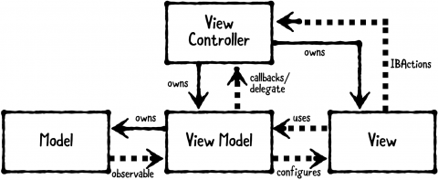
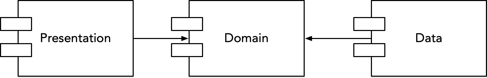
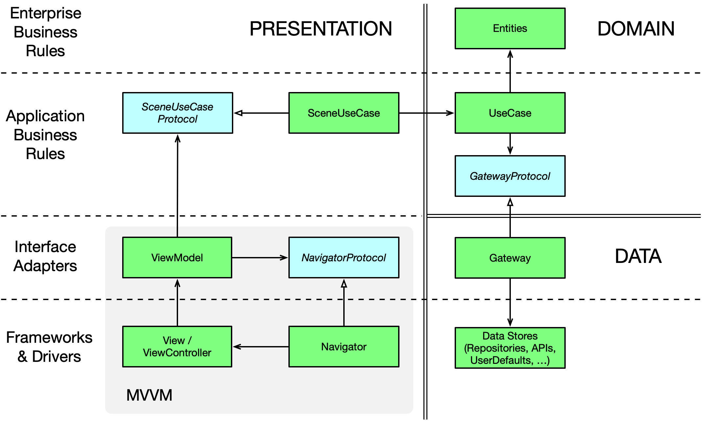
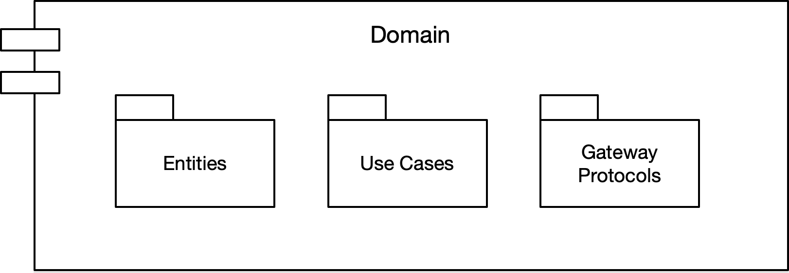
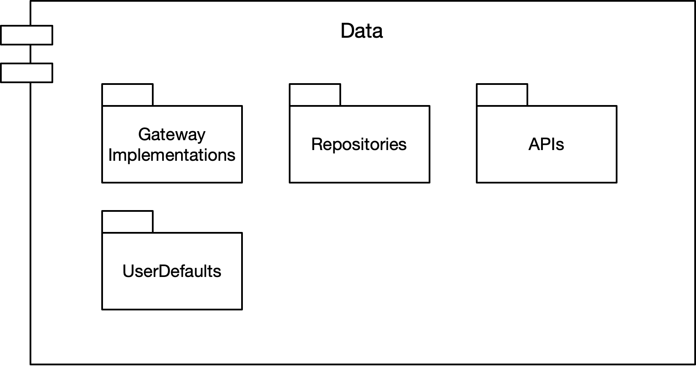
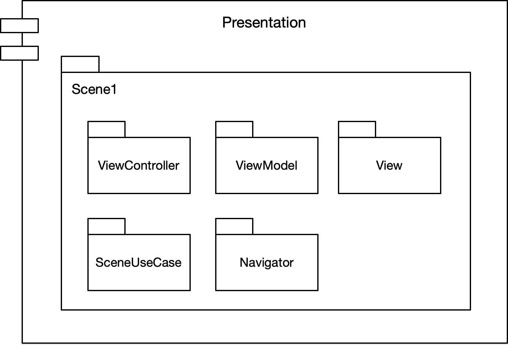
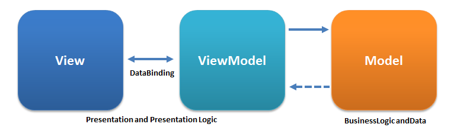
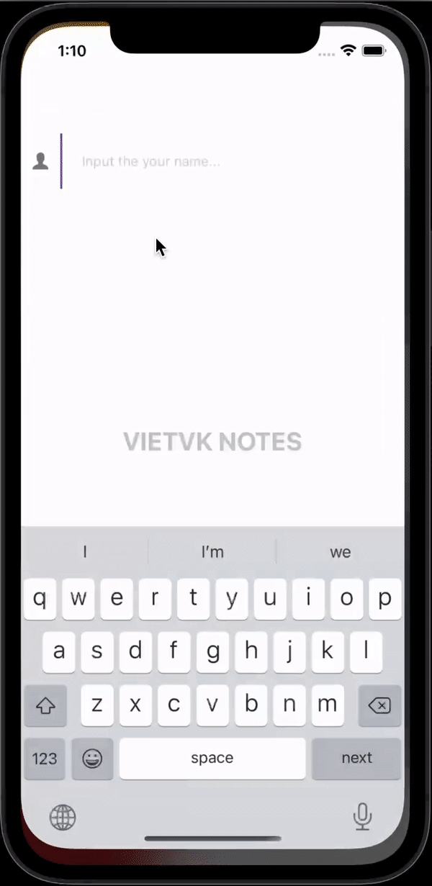

# The Notes project applies the Clean Architecture (MVVM + Combine)
## Hello World!

**Hello** this is my simple **Notes** project as a applicant's challenging assignment for applying for the Senior iOS developer position

In this project I apply MVVM in combination with clean architecture and more...

## MVVM (Model–View–ViewModel)

MVVM is now one of the most loved patterns out there, as it has had plenty of time to mature. The web community adopted the pattern after the Microsoft team formalized it in 2005. It eventually made its way into every UI-based framework.
One key advantage of MVVM is that it offers the right amount of decoupling. Another good thing is that the learning curve is similar to the other patterns.

MVVM has three main components: Model, View, and ViewModel.



## Why MVVM with Clean Architecture?
MVVM separates our view from our business logic. MVVM is enough for small projects, but when our codebase becomes huge, our ViewModels start bloating. Separating responsibilities becomes hard.

MVVM with Clean Architecture is pretty good in such cases. It goes one step further in separating the responsibilities of our code base. It clearly abstracts the logic of the actions that can be performed in our app.

## Advantages of Using Clean Architecture

1. our code is even more easily testable than with plain MVVM. 
   
2. our code is further decoupled (the biggest advantage.)
   
3. The package structure is even easier to navigate.
   
4. The project is even easier to maintain.
   
5. our team can add new features even more quickly.

## High Level Overview


* **Domain Layer**: Entities + Use Cases + Gateway Protocols
* **Data Layer**: Gateway Implementations + API (Network) + Database
* **Presentation Layer**: ViewModels + Views  + Navigator + Scene Use Cases

**Dependency Direction**




## Detail Overview



### Domain Layer



#### Entities
Entities encapsulate enterprise-wide Critical Business Rules. An entity can be an object with methods, or it can be a set of data structures and functions. It doesn’t matter so long as the entities can be used by many different applications in the enterprise. - _Clean Architecture: A Craftsman's Guide to Software Structure and Design (Robert C. Martin)_

Entities are simple data structures:

```swift
struct User {
    var id: String
    var userName: String
}
```

#### Use Cases

The software in the use cases layer contains application-specific business rules. It encapsulates and implements all of the use cases of the system. These use cases orchestrate the flow of data to and from the entities, and direct those entities to use their Critical Business Rules to achieve the goals of the use case. - _Clean Architecture: A Craftsman's Guide to Software Structure and Design (Robert C. Martin)_

UseCases are protocols which do one specific thing:

```swift
protocol GettingNotes {
    var noteGateway: NoteGatewayType { get }
}

extension GettingNotes {
    func getNotes(_ user: User) -> Observable<[Note]> {
        noteGateway.getNote(user)
    }
}
```

#### Gateway Protocols
Generally gateway is just another abstraction that will hide the actual implementation behind, similarly to the Facade Pattern. It could a Data Store (the Repository pattern), an API gateway, etc. Such as Database gateways will have methods to meet the demands of an application. However do not try to hide complex business rules behind such gateways. All queries to the database should relatively simple like CRUD operations, of course some filtering is also acceptable. - [Source](https://crosp.net/blog/software-architecture/clean-architecture-part-2-the-clean-architecture/)

```swift
protocol NoteGatewayType {
    func getNotes(_ user: User) -> Observable<[Note]>
}
```

_Note: For simplicity we put the Gateway protocols and implementations in the same files. In fact, Gateway protocols should be at the Domain Layer and implementations at the Data Layer._


### Data Layer



Data Layer contains Gateway Implementations and one or many Data Stores. Gateways are responsible for coordinating data from different Data Stores. Data Store can be Remote or Local (for example persistent database). Data Layer depends only on the Domain Layer.

### Presentation Layer



In the current example, Presentation is implemented with the MVVM pattern and heavy use of Combine, which makes binding very easy.



#### ViewModel

* ViewModel is the main point of MVVM application. The primary responsibility of the ViewModel is to provide data to the view, so that view can put that data on the screen.
* It also allows the user to interact with data and change the data.
* The other key responsibility of a ViewModel is to encapsulate the interaction logic for a view, but it does not mean that all of the logic of the application should go into ViewModel.
* It should be able to handle the appropriate sequencing of calls to make the right thing happen based on user or any changes on the view.
* ViewModel should also manage any navigation logic like deciding when it is time to navigate to a different view.
[Source](https://www.tutorialspoint.com/mvvm/mvvm_responsibilities.htm)

ViewModel performs pure transformation of a user Input to the Output:

```swift
public protocol ViewModel {
    associatedtype Input
    associatedtype Output
    
    func transform(_ input: Input, cancelBag: CancelBag) -> Output
}
```
A ViewModel can be injected into a ViewController via property injection or initializer. In the current example, this is done by Assembler.

```swift
protocol UsersAssembler {
    func resolve(navigationController: UINavigationController) -> UsersViewController
    func resolve(navigationController: UINavigationController) -> UsersViewModel
    func resolve(navigationController: UINavigationController) -> UsersNavigatorType
    func resolve() -> UsersUseCaseType
}
```
#### Scene Use Case
Scene Use Case acts as an intermediary between the Presentation Layer and the Domain Layer. It includes individual use cases for each screen, which makes testing the ViewModel easier.

Scene Use Case uses the Facade pattern.

```swift
protocol UsersUseCaseType {
    func getUsers() -> Observable<[User]>
}

struct UsersUseCase: UsersUseCaseType, GettingUsers {
    let userGateway: UserGatewayType
    
    func getUsers() -> Observable<[User]> {
        return getRepos(dto: dto)
    }
}
```
## Project Folder and File Structure

```
- /CleanArchitecture    
    - /Domain
        - /UseCases
            - /Note
                - GettingNote.swift
                - CreatingNote.swift
                ...
            - /User
        - /Entities
            - User.swift
            - Note.swift
    - /Data
        - /Gateways
            - NoteGateway.swift
            - UserGateway.swift
            ...
        - /FirebaseService
            - FirebaseService.swift
    - /Scenes
        - /Users
        - /UserDetail
        - /Note
        ...
    - /Helper
        - /Extension
            - UIViewController+.swift
            - UITableView+.swift
            ...
    - /Resources
        - /Assets.xcassets
    - AppDelegate.swift
    - Assembler.swift
    - ...

```
## Demo
 

## Check list
1. As a user (of the application) I can set my username ✔

2. As a user, I can save a short note to the Firebase database. ✔

3. As a user, I can see a list of my saved notes. ✔

4. As a user, I can see all the notes from other users. ✔

## Thanks
Last but not least, I would really apprciated you for taking time to review my project so far, this is just such a simple project having done in my spare time in 3 days (of course I have tasks at my company as well) can't express all my abilities and experiences, so I hope I can have chance to talk and and discuss with you about the iOS development.

Thanks ❤️ and happy coding! 💻
